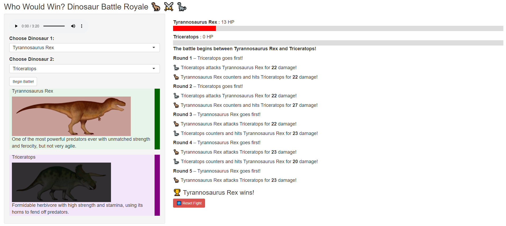

# Dinosaur Battle Shiny App 🦖 ⚔️ 🦕
When R Shiny meets my young dinosaur-enthused stakeholder, we get this interactive dino-adventure and feature requests become roars and user acceptance testing involves stomping feet.

You can access the live Shiny app here: [Dinosaur Battle App](https://analytically-ray.shinyapps.io/dinosaur_battle_app/)

## About the App

The **Dinosaur Battle Royale app** allows users to simulate battles between different dinosaurs. It's designed to be an **interactive experience** for dinosaur enthusiasts.

## Features

* **Dinosaur Selection**: Choose from a variety of dinosaur species to pit against each other, including:
    * Allosaurus
    * Baryonyx
    * Dilophosaurus
    * Giganotosaurus
    * Megalosaurus
    * Spinosaurus
    * Tyrannosaurus Rex
    * Velociraptor
    * and many more

* **Battle Statistics**: View battle statistics based on dinosaur characteristics. Statistics include strength, speed, ferocity, intelligence, agility and stamina. Statistics were generated by ChatGPT, claimed to be scientifically accurate. The battles are probabilistic, but generally, the speed determines which dinosaur attacks first in a battle, and the damage done is based on the other statistics.

* **Dinosaur Locations**: View a map showing where dinosaurs have been found. Dinosaur locations were generated by ChatGPT.

* **Battle Log**: Battle log shows the real-time health points of each dinosaur during the battle, as well as the attacks and counters of each round.

## How to Use

1.  **Select Dinosaurs**: Choose a dinosaur for "Dinosaur 1" and another for "Dinosaur 2" from the provided dropdown lists. 
2.  **Dinosaur Statistics**: View the battle statistics of each dinosaur and the countries where they are found.
3.  **Initiate Battle**: Once you've selected both dinosaurs, click "Begin Battle" and the app will simulate a battle between them.

## Access the App

You can access the live Shiny app here: [Dinosaur Battle App](https://analytically-ray.shinyapps.io/dinosaur_battle_app/)

## Tools
  

## Notes and Lessons Learned
* Built using RStudio and ChatGPT to experiment with Vibe Coding on top of my 10-years experience using R.
* Vibe coding can create a vast majority of the code and helps to easily add features, but when certain specific errors or obstacles happen, ChatGPT seems to cycle through the same instructions that don't work. This is when human deduction and expertise are needed. Most of the time, the errors are minor issues that can be fixed by a fundamental understanding of R.